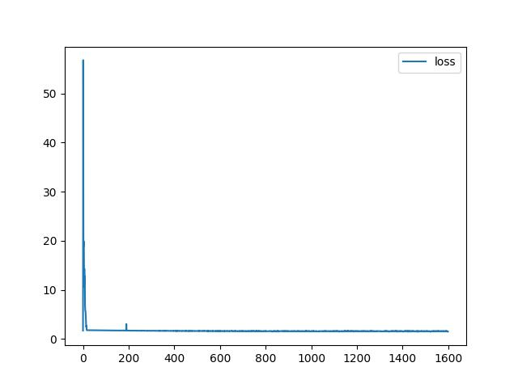
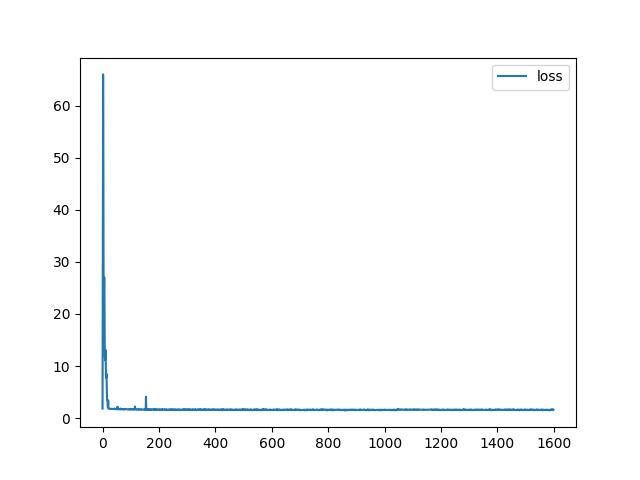
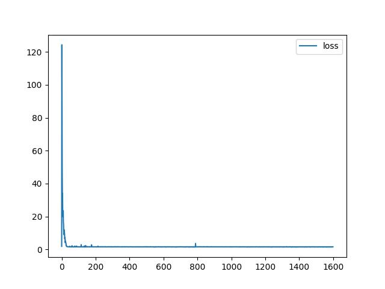
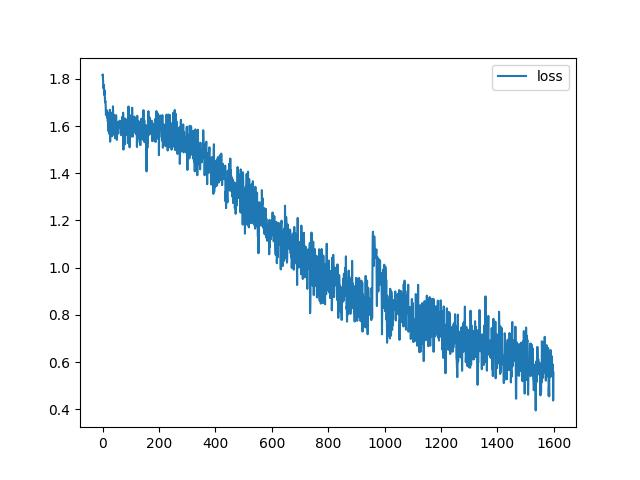
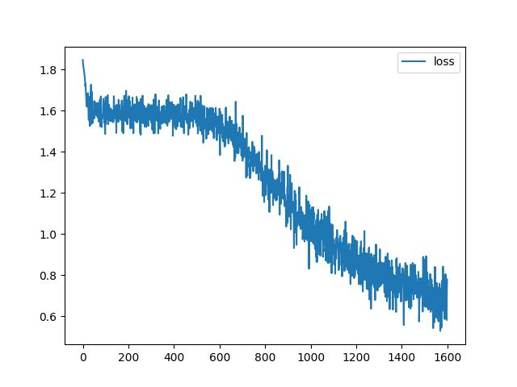
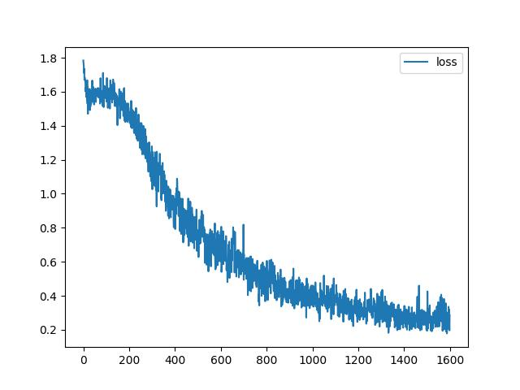

### Run ML soultion
    python ml.py
### Run fully connected soultion
    python fc.py
### Run LSTM soultion
    python LSTM.py

## Results
### ML
| Model                      | Accuracy, % |
|----------------------------|-------------|
| Gaussian NB                | 34.1        |
| Random forest, grid search | 47.3        |
### Fully-connected
| Model               | Accuracy, % |
|---------------------|-------------|
| FC 2 layers, hs 128 | 35.2        |
| FC 5 layers, hs 128 | 35.2        |
| FC 2 layers, hs 512 | 35.2        |
### LSTM
| Model                | Accuracy, % |
|----------------------|-------------|
| LSTM 2 layers, hs 32 | 78.2        |
| LSTM 5 layers, hs 32 | 72.4        |
| LSTM 2 layers, hs 64 | 88.4        |

## Models training
### Fully-Connected
#### FC 2 layers, hidden size 128

#### FC 5 layers, hidden size 128

#### FC 2 layers, hidden size 512

### LSTM
#### LSTM 2 layers, hidden size 32

#### LSTM 5 layers, hidden size 32

#### LSTM 2 layers, hidden size 64

## Выводы
1. Классическим методам крайне трудно выявить комплексные закономерности для решения подобной задачи.
2. TF-IDF векторизация работает хуже обучаемых эмбеддингов
3. Посимвольная токенизация крайне плоха для решения подобных задач
4. Полносвязная модель слишком слабая и простая для того, чтобы выявить подобные закономерности.
5. LSTM учится куда лучше и стабильнее остальных моделей, особенно с увеличением hidden size
6. Добавление слоев в LSTM не улучшает результат
## Возможности для улучшения
1. Более качественная токенизация, использование токенайзеров по словам/частям слов
2. Тюнинг гиперпараметров LSTM
3. Использование более совершенных моделей (encoder-only трансформеры)
